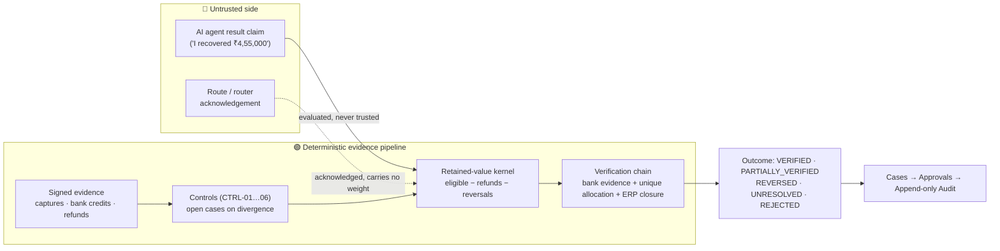

<div align="center">

# MoneyTrace

### The revenue‑integrity control plane that keeps AI agents honest about money.

**When an autonomous agent claims _"I recovered ₹4,55,000"_, MoneyTrace doesn't believe it. It proves it — against independent, deterministic evidence — before a single rupee is ever called "recovered."**

[](https://www.typescriptlang.org/)
[](https://nodejs.org/)
[](#tech-stack)
[](#safety-model--non-negotiables)
[](#option-a--instant-demo-no-backend-needed-)

</div>

---

## Table of contents

- [Why this matters to Razorpay](#why-this-matters-to-razorpay)
- [The problem](#the-problem)
- [What MoneyTrace is](#what-moneytrace-is)
- [The core idea: a trust boundary around money](#the-core-idea-a-trust-boundary-around-money)
- [The agent‑claim lifecycle](#the-agent-claim-lifecycle-the-heart-of-the-system)
- [Key capabilities](#key-capabilities)
- [Architecture](#architecture)
- [Tech stack](#tech-stack)
- [Repository layout](#repository-layout)
- [Getting started](#getting-started)
- [The 5‑minute guided demo](#the-5-minute-guided-demo)
- [Commands](#commands)
- [Testing & quality gates](#testing--quality-gates)
- [Safety model & non‑negotiables](#safety-model--non-negotiables)
- [Where this goes next](#where-this-goes-next)

---

## Why this matters to Razorpay

The next wave of fintech isn't humans clicking dashboards — it's **AI agents acting on financial systems**: chasing failed payouts, reconciling settlements, reversing duplicate collections, closing receivables. Razorpay sits at the exact center of that world — **Payments, RazorpayX, Route, Settlements, refunds, and payout rails.**

But agents have one dangerous property: **they are confident, and they can be wrong.** An agent that reports "money recovered" when it wasn't — or that double‑counts a refund as a recovery — doesn't just make a mistake; it corrupts financial truth, audit trails, and customer trust.

**MoneyTrace is the missing control plane for the agent economy.** It treats every agent as an **untrusted external party**, and only lets an outcome become "verified financial value" when independent evidence — a real bank credit, a unique allocation, a recorded ERP closure — deterministically proves it. It is:

- **Directly Razorpay‑shaped** — it ingests Razorpay‑style events (`payment.captured`, refunds, bank credits, payout/transfer signals) and Razorpay Test‑mode webhooks, and models controls over the exact failure modes Razorpay operates against (unobserved transfers, settlement timeouts, duplicate collections, conflicting bank evidence).
- **A trust layer, not another agent** — it makes _any_ agent safe to deploy against money, which is a platform capability Razorpay can offer merchants and internal teams alike.
- **Auditable and defensible by construction** — every fact and decision is append‑only, evidence‑cited, and reproducible, which is exactly what a regulated payments company needs before letting automation touch funds.

> If Razorpay's future includes autonomous agents anywhere near money movement — and it does — **something like MoneyTrace has to exist.** This repo is a working, evidence‑led prototype of it.

---

## The problem

Give an AI agent a goal like _"recover this failed payout"_ and it will happily report success. Three things then go wrong in real financial systems:

1. **A claim is not a fact.** An agent saying "recovered" — or even a downstream system *acknowledging* an action — is not proof that money actually moved.
2. **Acknowledgement ≠ verification.** A payout router returning `202 Accepted` tells you a request was received, not that a bank credited an account.
3. **Netting hides reversals.** If "restored", "prevented", "reversed" and "unresolved" are summed into one headline number, a refund that silently reverses a recovery disappears — and the books lie.

MoneyTrace refuses all three.

---

## What MoneyTrace is

A **modular‑monolith financial control plane** (TypeScript) that sits between untrusted agents/connectors and your financial ledger:

- It **ingests evidence** from sources (payments, banks, ERP, synthetic connectors) as signed, deduplicated, quarantine‑aware canonical events.
- It runs **deterministic controls** that open **cases** wherever expected money movement diverges from observed reality.
- It accepts **agent result claims** as *untrusted input* and **evaluates** them against a pure retained‑value kernel — never letting a claim change a source fact.
- It gates high‑impact actions behind **role‑based human approval** with an immutable decision basis.
- It records everything in an **append‑only audit trail** you can replay.

A polished **React operator console** (Overview, Cases, Approvals, Audit, Data Health) makes all of this visible in ten seconds.

---

## The core idea: a trust boundary around money



The agent's claim and the router's acknowledgement live permanently on the **untrusted** side. They are inputs, never conclusions. Only the deterministic pipeline — evidence the system independently observed — can move value into "verified."

---

## The agent‑claim lifecycle (the heart of the system)

An `AgentResultClaim` is an **untrusted external claim** and is evaluated independently. Its status is a deterministic function of persisted evidence, and it can move *backwards*:

| Status | Meaning |
| --- | --- |
| `PENDING` | Claim received; no independent confirmation yet. |
| `VERIFIED` | Retained value equals the claim, proven by evidence. |
| `PARTIALLY_VERIFIED` | Some — not all — of the claim is independently supported. |
| `REVERSED` | Was verified, then a correlated refund returned retained value to zero. |
| `UNRESOLVED` | Conflicting evidence; automatic closure blocked. |
| `REJECTED` | Blocked (e.g. a duplicate collection prevented). |

**Verification requires all three, independently observed:**

1. **Independent bank evidence received** (a real bank credit line, not a router `ACK`)
2. **Unique allocation** — no double counting against the same obligation
3. **ERP closure recorded** — requesting closure is not the same as observing it

Retained value is a pure kernel:

```
verified_incremental_recovery =
    max(0, eligible_captures − linked_refunds − linked_reversals − linked_disputes − already_restored_baseline)
```

Nothing is netted in the browser; each figure is a distinct, server‑evaluated field.

---

## Key capabilities

- **Evidence ingestion** — canonical events with HMAC‑authenticated sources, idempotent de‑duplication, and quarantine of tampered/unsigned payloads (Razorpay Test webhooks map straight in).
- **Six deterministic controls** (`CTRL‑01…06`) — missing transfer at payout, settlement timeout, open receivable, duplicate‑recovery risk, conflicting bank evidence, duplicate‑event safety.
- **Cases** — every divergence becomes a case with a full **expected‑vs‑observed money path**, evidence timeline, verification timeline, and a six‑artifact control‑loop rail.
- **Role‑based approvals** — high‑impact actions require the **Finance Approver** role, bound to an immutable decision‑basis hash with idempotency keys; new evidence invalidates a stale approval.
- **Append‑only audit replay** — ordered, immutable, evidence‑cited artifacts per case, with a redacted export.
- **Operator console** — Overview (agent‑claim truth panel + KPIs), Cases, Approvals, Audit, Data Health.
- **Deterministic demo mode** — four replayable scenarios (claim reversal, missing‑transfer remediation, conflicting bank evidence, duplicate replay) and four seeded demo roles, driven from the UI with **no backend required**.

---

## Architecture

A **contracts‑first modular monolith** with strictly enforced boundaries:

```
Untrusted sources / agents
        │  (HMAC, dedupe, quarantine)
        ▼
  Ingestion → Projection → Controls ──▶ Cases
        │                                 │
        ▼                                 ▼
  Agent claims ─▶ Claim evaluation    Approvals (role‑gated)
        │              │                  │
        ▼              ▼                  ▼
  Verification · Reconciliation ────▶ Append‑only Audit
        │
        ▼
  Read models ─▶ Fastify API (/v1/*) ─▶ React operator console
```

- **`contracts/`** — versioned Zod + OpenAPI schemas. Pure and browser‑safe; the single source of truth shared by server and web.
- **`domain/`** — the pure financial kernel (money math, retained‑value, state machines). No I/O, no framework.
- **`modules/`** — behaviour: ingestion, projection, invariants (controls), cases, claims/agent‑claims, approvals, actions, verification, reconciliation, provenance, investigation, demo.
- **`api/`** — Fastify entry + `/v1/*` routes and safe error handling.
- **`worker/`** — pg‑boss worker for async jobs (imports, scenario steps, projections).
- **`web/`** — React 18 + Vite operator console.

Boundaries are **machine‑enforced**: `domain` and `contracts` stay pure, `web` cannot import server/config code, and no source file may import hidden ground‑truth fixtures — verified by `tests/unit/architecture-boundaries.test.ts` and ESLint.

---

## Tech stack

| Layer | Technology |
| --- | --- |
| Language | TypeScript (strict) on Node ≥ 20.19, ESM |
| API | Fastify + Zod‑validated contracts |
| Worker | pg‑boss (PostgreSQL‑backed jobs) |
| Data | PostgreSQL via Drizzle ORM (Supabase‑compatible) |
| Web | React 18 · Vite · React Query · Radix UI |
| Validation | Zod contracts shared across server + browser |
| Tests | Vitest (unit + integration) · Playwright (e2e) |
| Tooling | ESLint · Prettier · strict `tsc` |

---

## Repository layout

```
src/
  contracts/     versioned Zod/OpenAPI schemas (pure, browser‑safe)
  domain/        pure financial kernel — money, retained‑value, state machines
  modules/       ingestion · projection · invariants (CTRL‑01…06) · cases ·
                 claims · agent‑claims · approvals · actions · verification ·
                 reconciliation · provenance · investigation · demo
  api/           Fastify entry point + /v1 routes + safe error handler
  worker/        pg‑boss worker entry point + job handlers
  web/           React/Vite operator console (Overview, Cases, Approvals, Audit, Data Health)
  config/        env, dotenv, logger, errors, db (server‑only)
db/              SQL migrations
fixtures/        public‑shaped, synthetic, hidden‑ground‑truth
tests/           unit · integration · e2e · architecture‑boundary
docs/            PRDs, ADRs, implementation reports
```

---

## Getting started

### Prerequisites

- **Node.js ≥ 20.19** and npm
- (Full‑stack only) **PostgreSQL 14+** — local, Docker, or a free Supabase project
- Install dependencies:

  ```bash
  npm install
  ```

There are two ways to run MoneyTrace. **Start with Option A** — it's the fastest way to see the whole product.

### Option A — instant demo, no backend needed ⭐

The operator console ships with a deterministic, fixture‑driven demo mode, so you can explore **the entire application** — Overview, Cases, Approvals, Audit, the agent‑claim truth panel, and all four demo scenarios — with a single command and **no database, worker, or API**.

```bash
npm run dev:web
```

Open the URL Vite prints (default **http://127.0.0.1:5173**). That's it. Jump to [The 5‑minute guided demo](#the-5-minute-guided-demo).

### Option B — the full stack (API + worker + web + PostgreSQL)

1. **Configure the environment.** Copy the template and fill in **local / test‑mode** values only:

   ```bash
   cp .env.example .env
   ```

   Key variables (see `.env.example` for the full list):

   | Variable | Purpose |
   | --- | --- |
   | `MONEYTRACE_ENV` | `demo` \| `buildathon` \| `test` \| `development` \| `production` |
   | `DATABASE_URL` | PostgreSQL connection string |
   | `API_PORT` / `API_HOST` | HTTP API bind (default `127.0.0.1:3000`) |
   | `RAZORPAY_KEY_ID` / `_SECRET` / `_WEBHOOK_SECRET` | **Test‑mode** Razorpay creds (optional) |
   | `SYNTHETIC_SOURCE_HMAC_SECRET` | Auth for synthetic source connectors |
   | `MODEL_PROVIDER` | Provider‑neutral model gateway (default `stub`) |

   > 🔒 In `demo`/`buildathon` environments, Razorpay **live** keys (`rzp_live_…`) are **rejected at startup** — the prototype can never move real money.

2. **Create the schema and seed reference data:**

   ```bash
   npm run db:migrate
   npm run db:seed
   ```

3. **Generate the synthetic 500‑record dataset** (the demo lifecycle data):

   ```bash
   npm run db:import-demo
   ```

4. **Run the three processes** (each in its own terminal):

   ```bash
   npm run dev:api      # Fastify API on http://127.0.0.1:3000
   npm run dev:worker   # pg-boss worker (applies imports & scenario steps)
   npm run dev:web      # Vite console on http://127.0.0.1:5173 (proxies /v1 → :3000)
   ```

   Reset or replay the dataset anytime with `npm run db:reset` / `npm run db:replay`.

---

## The 5‑minute guided demo

The console has four seeded demo roles (top‑right switcher) — **Viewer, Investigator / Case Manager, Finance Approver, Demo Operator / Auditor**. Roles change what you're allowed to *do*; scenarios change the *data*.

1. **Overview** — the agent‑claim panel starts empty: *"No agent claim comparison in this dataset stage."* The system invents nothing.
2. Switch to **Demo Operator / Auditor** → click **Demo scenarios** → advance **claim reversal** one step at a time and watch the outcome move **PENDING → VERIFIED → REVERSED (₹0)** live, with the KPI cards updating in lock‑step. This is the whole thesis in fifteen seconds: _an agent's word is never the last word._
3. **Cases** — open any case to see the **expected‑vs‑observed money path** (where the trail breaks), the evidence timeline, and the verification timeline (an acknowledgement is not proof).
4. **Approvals** — as a Viewer the decision buttons are locked; switch to **Finance Approver** and the same action becomes approvable — confirmed, recorded, and reflected in the tab counts instantly.
5. **Audit** — every fact and decision, append‑only and in order, ready to replay.

All four scenarios (`claim reversal`, `missing‑transfer remediation`, `conflicting bank evidence`, `duplicate replay`) drive distinct, deterministic outcomes on the Overview.

---

## Commands

| Command | What it does |
| --- | --- |
| `npm run setup` | Install dependencies + Chromium for browser tests |
| `npm run dev:web` | Run the Vite operator console (fixture demo — no backend) |
| `npm run dev:api` | Run the Fastify API (tsx watch) |
| `npm run dev:worker` | Run the pg‑boss worker (tsx watch) |
| `npm run db:migrate` | Apply SQL migrations |
| `npm run db:seed` | Seed identity, sources, policy bundle, verification contracts |
| `npm run db:import-demo` | Generate the synthetic 500‑record dataset |
| `npm run db:reset` / `db:replay` | Reset / replay the demo dataset |
| `npm run build` | Emit runnable API + worker (`dist/`) and web bundle (`dist-web/`) |
| `npm run typecheck` | Strict TypeScript check of the whole repo |
| `npm run lint` | ESLint (incl. import‑boundary guard) |
| `npm run format` | Prettier check |
| `npm run test` | Unit + integration tests (Vitest) |
| `npm run test:e2e` | Browser tests (Playwright) |
| `npm run start:api` / `start:worker` | Run the built API / worker |

---

## Testing & quality gates

- **Contracts‑first** — every API response is validated against a shared Zod schema on both server and client; a mismatch fails loudly.
- **Architecture boundaries** — enforced in tests and ESLint (pure `domain`/`contracts`, `web` free of server code, hidden ground truth never imported).
- **Deterministic domain** — the money kernel and state machines are pure and unit‑tested, including reversal/clamping edge cases.
- **Run it all:**

  ```bash
  npm run typecheck && npm run lint && npm test
  ```

---

## Safety model & non‑negotiables

- **Never moves real money.** Live Razorpay keys are rejected at startup in demo/buildathon; actions are simulated.
- **Agents are untrusted.** A claim can never overwrite a source financial fact.
- **Acknowledgement is not verification.** Router `ACK`s are labelled and carry no evidentiary weight.
- **Nothing is netted.** Restored, prevented, reversed and unresolved are separate, independently reported outcomes.
- **Everything is auditable.** Append‑only artifacts, evidence‑cited, with safe error serialization and secret redaction in logs.
- **Humans stay in the loop** for high‑impact actions, bound to an immutable decision basis.

---

## Where this goes next

- Wire the operator console's live read models fully to `/v1/*` (the fixture layer already mirrors them 1:1).
- Expand the connector set beyond Razorpay Test + synthetic sources (bank statement feeds, ERP closure webhooks).
- Harden the provider‑neutral model gateway for real investigation assistants.
- Package the trust boundary as a service other Razorpay products and merchants can call before letting an agent touch funds.

---

<div align="center">

**MoneyTrace** — claim, verify, approve, audit.
_Make any AI agent safe to point at money._

</div>
